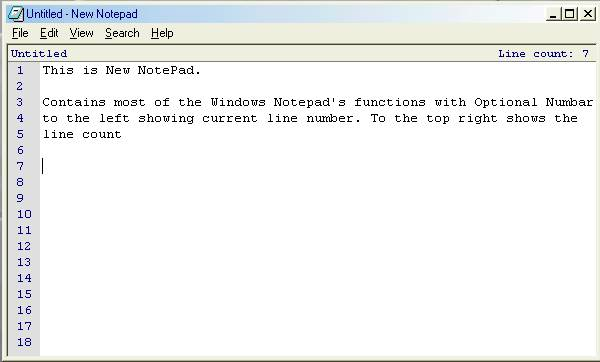



## New NotePad \(The Best\)

### Description

New NotePad has the same purpose as Windows NotePad To Create and edit text files.

With this new version it has line numbers to the left of the text which changes when you scroll with the scrollbar/Mouse scroll button. Also comes with line count.

See the screenshot.
 
### More Info
 

             |
---                |---
**Submitted On**   |2002-07-01 00:24:18
**By**             |[CoderFromHell](https://github.com/Planet-Source-Code/PSCIndex/blob/master/ByAuthor/coderfromhell.md)
**Level**          |Advanced
**User Rating**    |5.0 (30 globes from 6 users)
**Compatibility**  |VB 6\.0
**Category**       |[Files/ File Controls/ Input/ Output](https://github.com/Planet-Source-Code/PSCIndex/blob/master/ByCategory/files-file-controls-input-output__1-3.md)
**World**          |[Visual Basic](https://github.com/Planet-Source-Code/PSCIndex/blob/master/ByWorld/visual-basic.md)
**Archive File**   |[New\_NotePa1046107102002\.zip](https://github.com/Planet-Source-Code/coderfromhell-new-notepad-the-best__1-36772/archive/master.zip)

